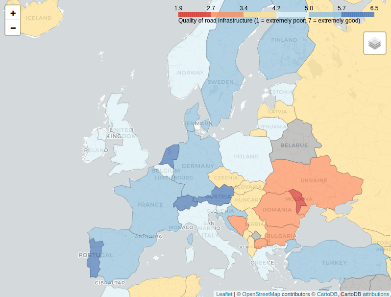

# World road quality

> Dashboard to show world road quality map.

To read my preliminary data analysis, visit [here](https://github.com/tamagusko/road-quality/blob/main/pages/analysis.md).

Access the data statement [here](https://github.com/tamagusko/road-quality/tree/main/data).

[Open interactive map](https://roadquality.tamagusko.com/)

## Author

Tiago Tamagusko – [@tamagusko](https://github.com/tamagusko)

## Bugs?

Found a bug or have any suggestions? Open an issue [here](https://github.com/tamagusko/road-quality/issues).

## Contributing

1. Fork it (<https://github.com/yourname/yourproject/fork>)
2. Create your feature branch (`git checkout -b feature/fooBar`)
3. Commit your changes (`git commit -am 'Add some fooBar'`)
4. Push to the branch (`git push origin feature/fooBar`)
5. Create a new Pull Request

Look at [TODO.md](https://github.com/tamagusko/road-quality/blob/main/TODO.md) for some suggestions.

---

© 2022 Tiago Tamagusko.
Open Source Project. Please see [LICENSE](https://github.com/tamagusko/road-quality/blob/main/LICENSE) for details.
